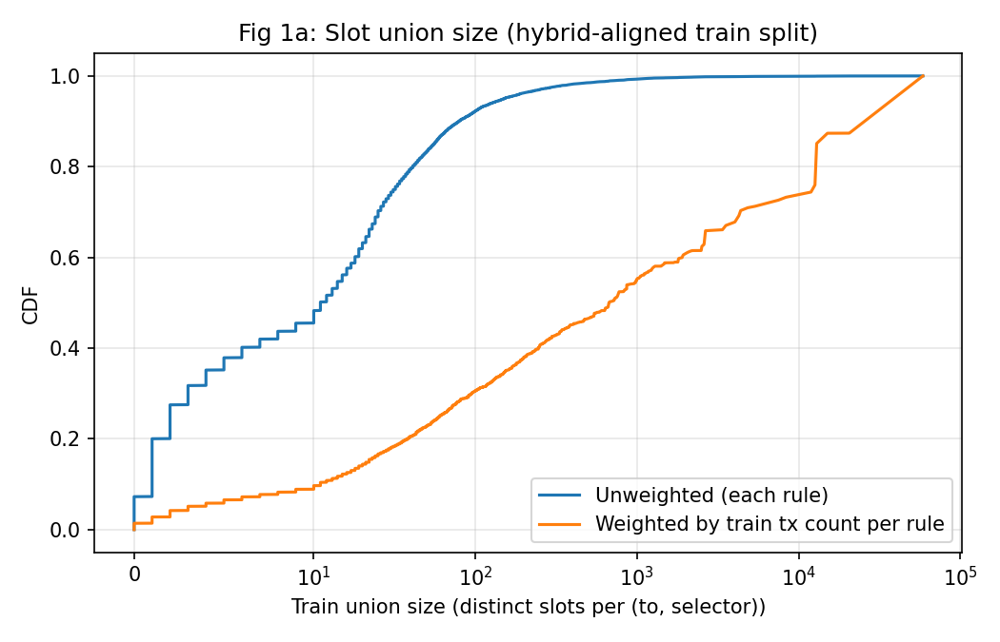
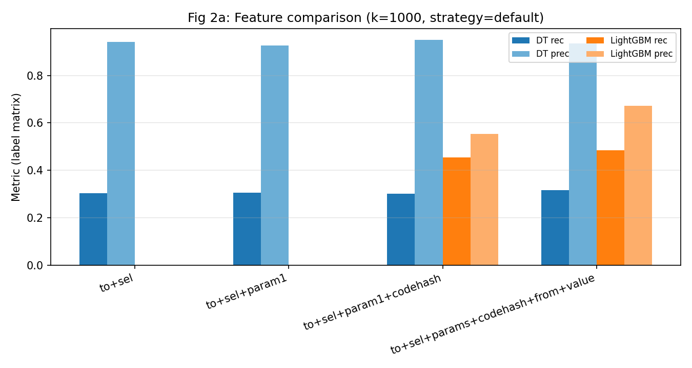
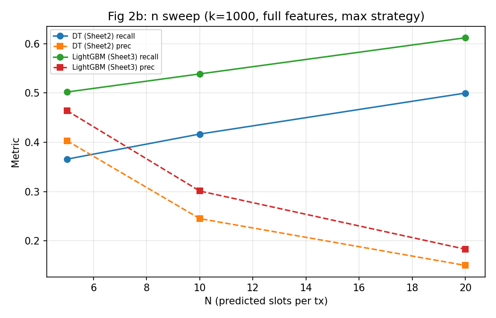
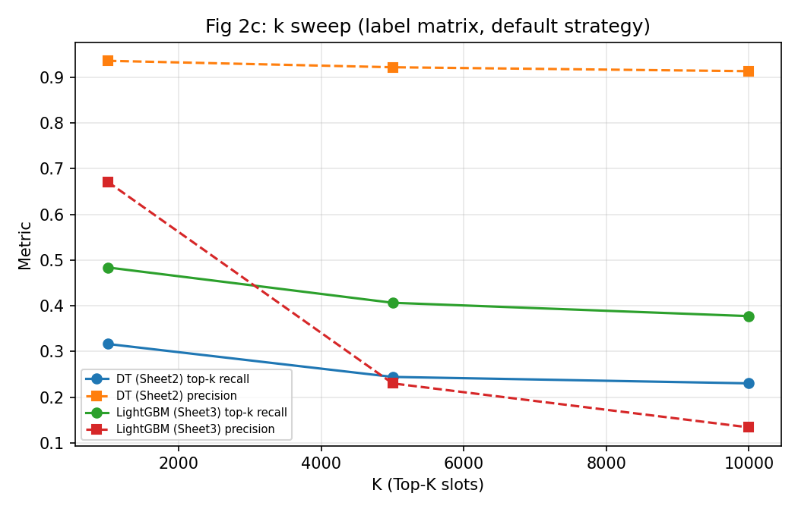
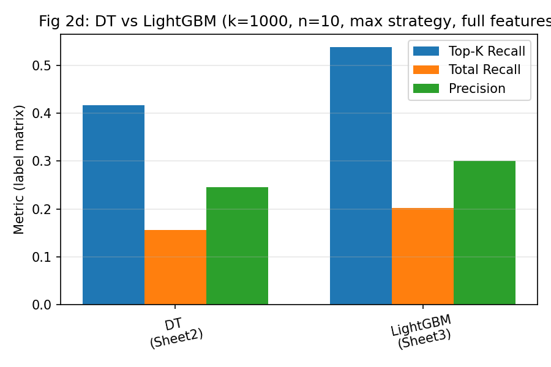
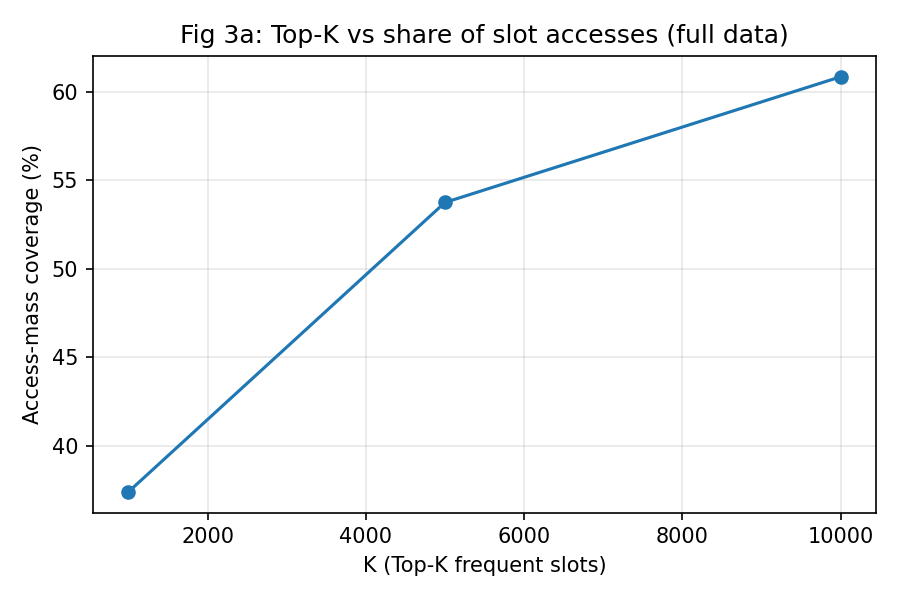
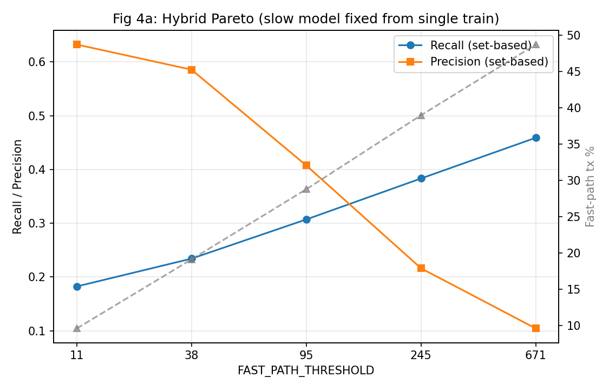
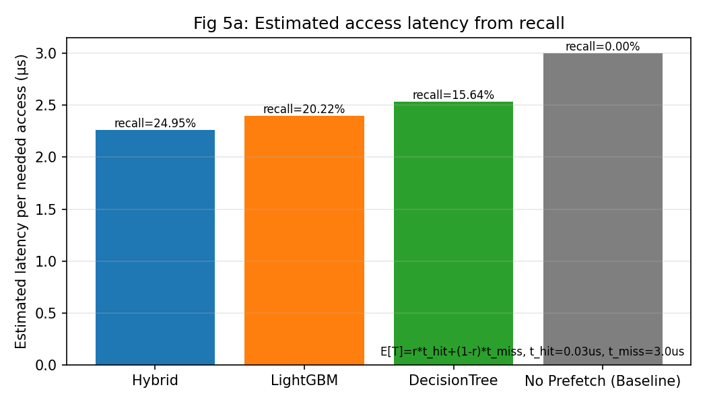

# 图表说明与研究过程串联

本文档用于论文/汇报中对各图的统一解释，并串联整体研究逻辑。  
对应图片位于 `evm_analysis/figures/`。

---

## 一、整体研究主线

我们的研究问题是：在 EVM 状态访问预测中，如何在可控精度与开销下提升可用性。  
图表叙事按以下四步展开：

1. **先看数据分布（问题是什么）**  
   状态访问规则的空间分布极不均匀，且按交易量加权后差异更明显。
2. **再看单模型能力（能做多好）**  
   比较 DecisionTree 与 LightGBM 在不同特征、`K`、`N` 设置下的 Recall/Precision。
3. **再看上限约束（天花板在哪里）**  
   Top-K 标签空间覆盖率限制了 Recall 的理论上界。
4. **最后看系统级折中（怎么落地）**  
   通过 Hybrid Router 在不同阈值下调节 Recall/Precision，并把指标映射为延迟收益估计。

---

## 二、逐图说明

## Fig 1a: `fig1a_slot_union_cdf.png`



- **图意**：`(to, selector)` 规则对应的 `slot union size` 分布（训练集口径）。  
- **两条曲线**：  
  - `Unweighted`：每条规则等权；  
  - `Weighted`：按该规则在训练集中的交易量加权。  
- **结论用途**：说明“规则复杂度分布”和“交易流量分布”不是同一个东西，后者更能解释线上负载。
- **数据来源**：`slot_distribution_analysis.py --export-csv`，输出 `figure1_train_union_keys.csv`。

---

## Fig 2a: `fig2a_feature_compare.png`



- **图意**：固定 `k=1000`、`strategy=default`，比较不同特征组合下 DT 与 LightGBM 的 `Top-K Recall` 与 `Precision`。  
- **结论用途**：验证“特征扩展 + 模型能力提升”对效果的影响方向。
- **数据来源**：`metrics_figure2_merged.csv`（来自 `evm-decision-tree-data.xlsx` Sheet1/2/3 合并）。

---

## Fig 2b: `fig2b_n_sweep.png`



- **图意**：固定特征与 `k=1000`，扫描 `N={5,10,20}`，观察 Recall/Precision 的权衡。
- **结论用途**：展示“每次输出 slot 数”对保守性（Precision）和覆盖性（Recall）的直接影响。
- **说明**：该图用于趋势展示，`N` 点位较少但足够表达 trade-off 方向。

---

## Fig 2c: `fig2c_k_sweep.png`



- **图意**：固定 full features、`strategy=default`，扫描 `K={1000,5000,10000}`。  
- **为什么这里可能出现“Precision 不降反升/非单调”**：  
  - 指标是多标签矩阵口径，`K` 变化同时改变了标签空间和类别频次分布；  
  - 不同模型在阈值/投票机制下，预测正例数与命中数的变化并不保证严格单调；  
  - 因此该图应解读为**经验结果**，不是理论必然单调曲线。  
- **结论用途**：比较不同模型随 `K` 扩张时的稳定性与收益。

---

## Fig 2d: `fig2d_model_compare_bar.png`



- **图意**：在同一配置（`k=1000, n=10, max strategy, full features`）下，对比 DT 与 LightGBM。  
- **包含指标**：`Top-K Recall`、`Total Recall`、`Precision`。  
- **结论用途**：作为“同配置下模型替换收益”的摘要图。

---

## Fig 3a: `fig3a_topk_access_mass.png`



- **图意**：`K` 对“访问次数覆盖率（access-mass coverage）”的影响。  
- **定义**：落在 Top-K slot 集合内的访问次数 / 总访问次数。  
- **结论用途**：用于解释 Recall 上限：如果覆盖率不高，模型 Recall 理论上界受限。
- **数据来源**：`topk_slot_coverage.py --export-csv`，输出 `figure3_topk_coverage.csv`。

---

## Fig 4a: `fig4a_hybrid_pareto.png`



- **图意**：Hybrid 架构在不同 `FAST_PATH_THRESHOLD` 下的 `Recall / Precision` 与 `Fast-path tx%`。  
- **阈值点选择**：采用“按交易量加权分位数反推”的阈值（当前使用 `11, 38, 95, 245, 671`）。  
- **关键假设**：Slow Path 模型固定，扫描中只改变 Fast/Slow 路由边界。  
- **结论用途**：展示可调 Pareto 前沿，支撑“按机器资源约束做弹性调优”。
- **数据来源**：`sweep_hybrid_threshold.py` 输出 `hybrid_pareto.csv`。

---

## Fig 5a: `fig5a_inference_latency.png`



- **图意**：基于 Recall 推导的“每次需要访问的估计延迟”对比（Hybrid / LightGBM / DT / Baseline）。  
- **估计公式**：  
  - `E[T] = r * t_hit + (1 - r) * t_miss`  
  - 其中 `r` 为对应方法的 Recall；当前参数为 `t_hit=0.03us`、`t_miss=3.0us`。  
- **Baseline 定义**：`No Prefetch`，即 `r=0`。  
- **重要说明**：这是一阶估计模型，不等同于 Erigon 生产端到端实测延迟。  
- **结论用途**：把离线指标映射为工程可解释的延迟收益量级。

---

## 三、指标口径与可比性声明（务必保留）

- **Fig2 系列**：来自 `train.py/train_light_gbm.py` 的**标签矩阵口径**指标。  
- **Fig4（Hybrid）**：来自 `train_hybrid.py` 的**集合交并口径**指标。  
- 两者 Recall/Precision **定义不同，不应在同一坐标轴直接数值比较**。  
- 建议在论文中明确写：  
  - “Fig2 用于比较模型在统一标签空间下的预测能力”；  
  - “Fig4 用于比较路由系统层面的整体行为”。

---

## 四、答辩/汇报时可直接使用的串讲模板

1. “我们先证明问题是长尾且流量不均（Fig1）。”  
2. “然后在统一设置下看单模型能力，LightGBM 在关键配置上优于 DT（Fig2）。  
   同时 K/N 的变化揭示了 Recall-Precision 的基本权衡。”  
3. “再用 Top-K 覆盖率给出理论上限解释（Fig3）：标签空间本身限制了可达 Recall。”  
4. “最后引入 Hybrid 路由，把复杂度分层处理并形成可调 Pareto（Fig4）。”  
5. “将 Recall 映射到延迟估计后，可得到系统层面的收益趋势（Fig5）。”  

---

## 五、复现命令（当前版本）

```bash
# 1) 合并 Fig2 数据（xlsx -> csv）
python evm_analysis/modeling/load_paper_metrics.py

# 2) Fig1 数据
python evm_analysis/analysis/slot_distribution_analysis.py --export-csv evm_analysis/figures/data/

# 3) Fig3 数据
python evm_analysis/analysis/topk_slot_coverage.py --export-csv evm_analysis/figures/data/

# 4) Fig4 数据（示例阈值）
python evm_analysis/analysis/sweep_hybrid_threshold.py --max-test-rows 4000 --thresholds 11 38 95 245 671

# 5) 生成全部图
python evm_analysis/viz/plot_figures.py --all
```

注：`Fig5` 当前为基于 Recall 的一阶估计图，不依赖纯推理耗时柱状数据。
